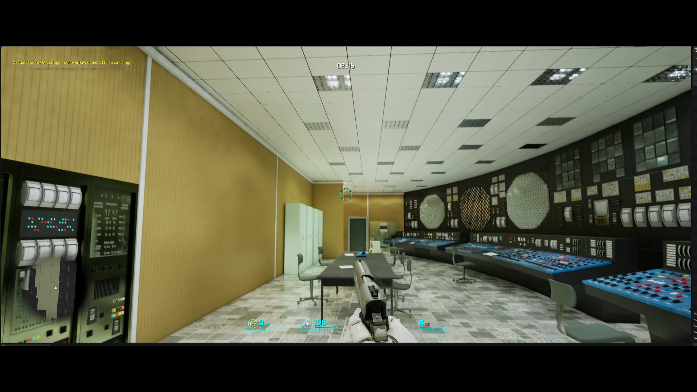
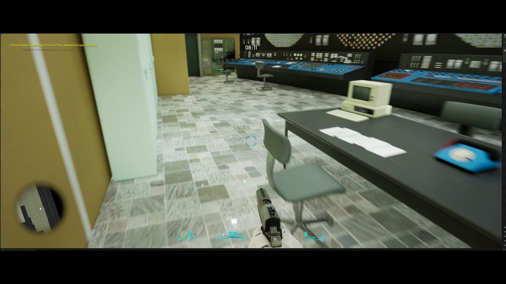
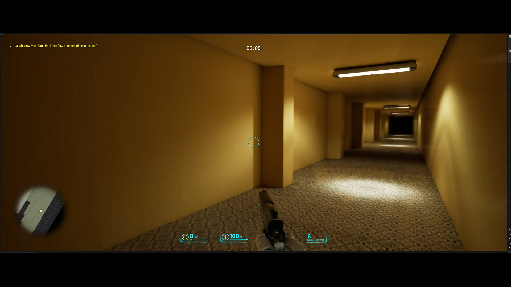
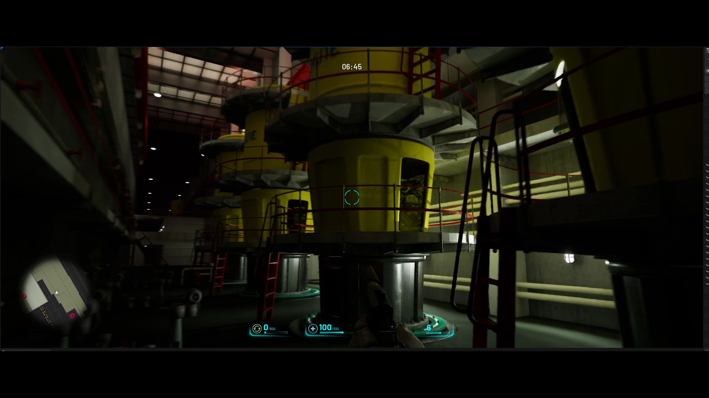
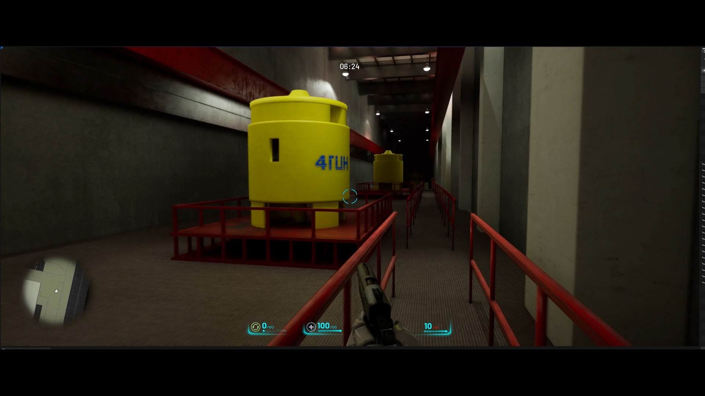
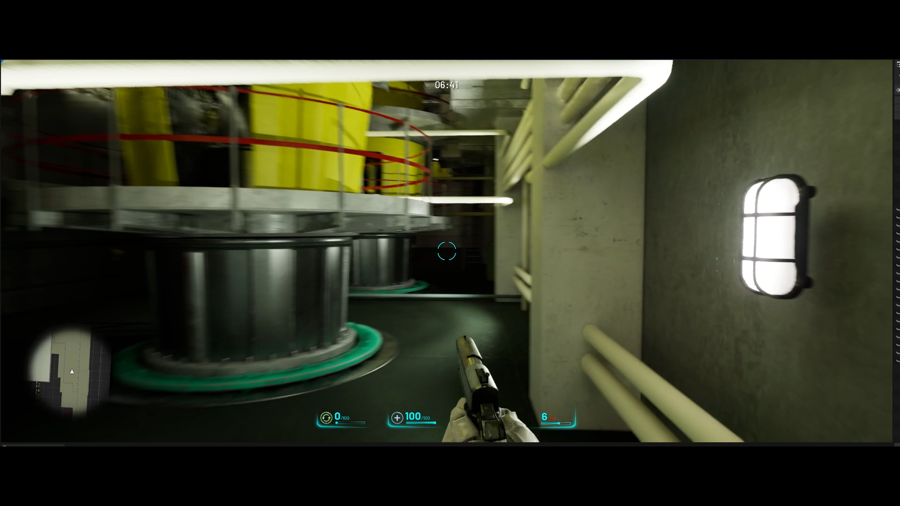

# Chernobyl86

Chernobyl86 is a first-person shooter prototype built in Unreal Engine. The premise is a time-travel mission in which the player goes to the Chernobyl nuclear plant before the explosion to prevent a major disaster while facing enemy agents sent back through time.

The prototype is also playable with a connected VR setup.

## Media

- [Prototype video on Google Drive](https://drive.google.com/file/d/1RPfdPK9EVcpUGbJgc9DpVfQlQo-R_llJ/view?usp=drivesdk)
- [Screenshot gallery on Google Drive](https://drive.google.com/drive/folders/1Xx-bjK6-PLKGQXPUWFQUaI5sIBhrvoE1)

## Technical Scope

- **Engine:** Unreal Engine
- **Status:** Prototype, not published
- **Genre:** First-person shooter with a time-travel scenario
- **VR:** Playable with a connected VR setup
- **Repository contents:** Documentation, one lightweight thumbnail and external media links only

## Notes

The full Unreal Engine source and playable build are not included in this repository.
