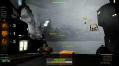

# Keyboard Warrior

Keyboard Warrior is my first published game. It was released on Steam on 31 March 2023 and was also a personal production test: designing, developing and publishing a complete game in approximately three months.

The core idea is simple: **Type Fast to Survive!**

The player protects a city from AI drones by controlling a turret through a camera-like interface. Incoming enemies are labelled with word-based IDs, and the turret targets and fires when the player types the correct ID. The game measures typing performance with indicators such as letters per second and words per minute.

## Links

- [Steam page](https://store.steampowered.com/app/2352770/Keyboard_Warrior/)
- [Trailer video on Google Drive](https://drive.google.com/file/d/1zKL-tLexjwFSXdkzlsYjRgFebNqmuiqs/view?usp=drivesdk)
- [Screenshot gallery on Google Drive](https://drive.google.com/drive/folders/14NqtqiwxtJ2TZgl7UeGM-Zcl7YkcJspM)

## Technical Scope

- **Engine:** Unreal Engine
- **Status:** Published game
- **Primary mechanic:** Typing-driven targeting and shooting
- **Repository contents:** Documentation, one lightweight thumbnail and external media links only

## Notes

The repository does not include the full Unreal project source or a packaged build for this game.
