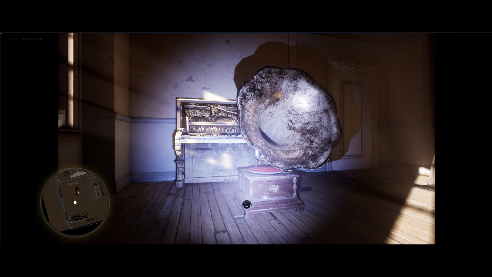
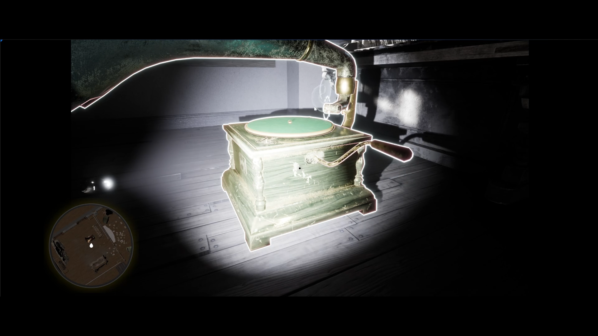
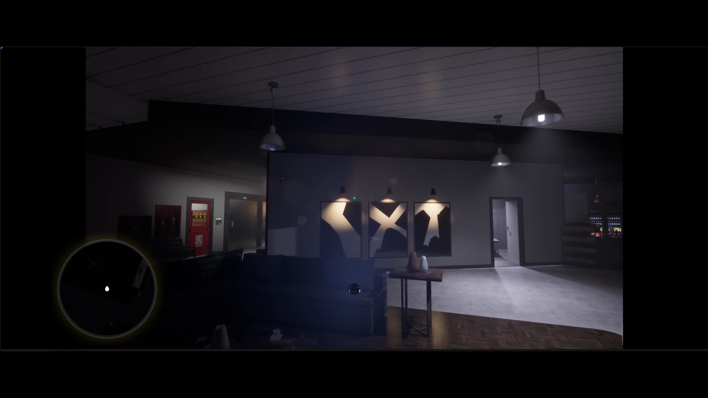
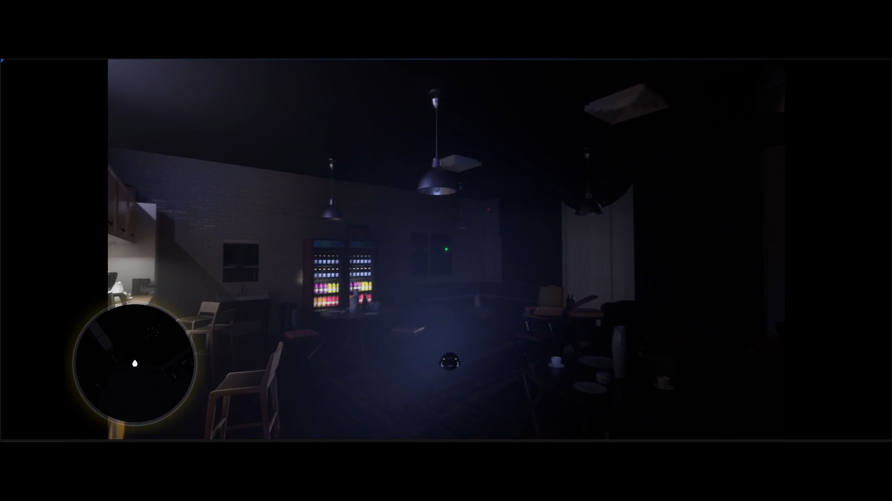
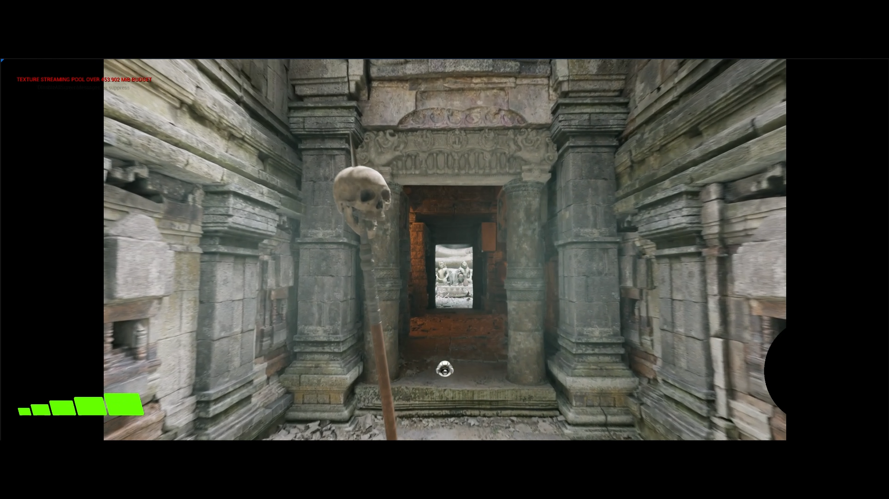

# Tiny Aliens

Tiny Aliens is an Unreal Engine prototype in which the player is a tiny alien visitor exploring Earth from a very small scale. The character is roughly 1 mm tall and uses a small flying spacecraft to move through abandoned places, workplaces and historical ruins.

The prototype explores scale, environmental navigation and object interaction. It was also adapted for VR.

## Media

- [Prototype video on Google Drive](https://drive.google.com/file/d/1gYMerfefPnaqi3lMxymWEmRS9RTQntIA/view?usp=drivesdk)
- [Screenshot gallery on Google Drive](https://drive.google.com/drive/folders/1qjOLnaduU0gU9p_up8FcC-i4Z6F-lkn6)

## Technical Scope

- **Engine:** Unreal Engine
- **Status:** Prototype, not published
- **Interaction focus:** Small-scale flying exploration and object interaction
- **VR:** Adapted for VR use
- **Repository contents:** Documentation, one lightweight thumbnail and external media links only

## Notes

The full Unreal Engine source and playable build are not included in this repository.
