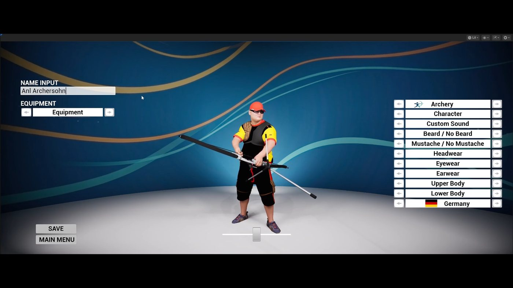
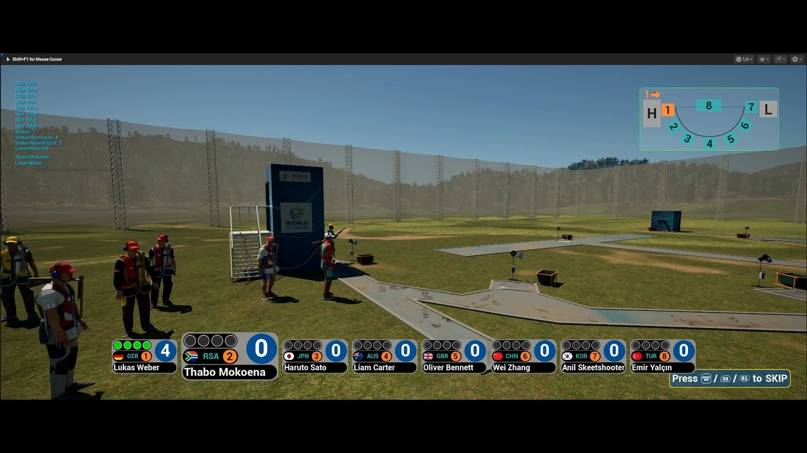
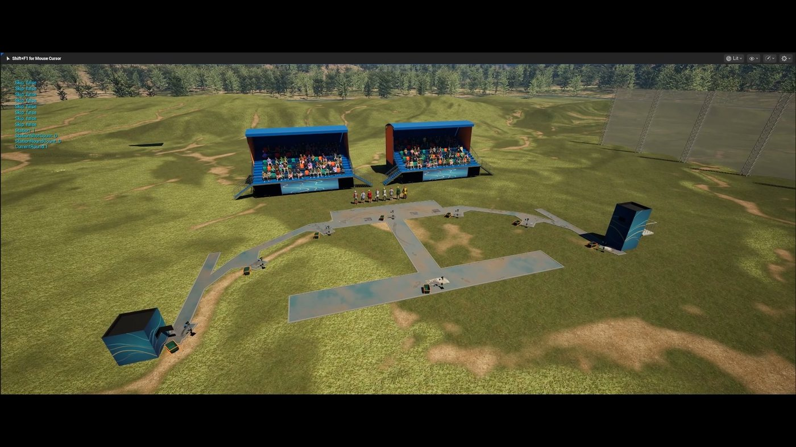
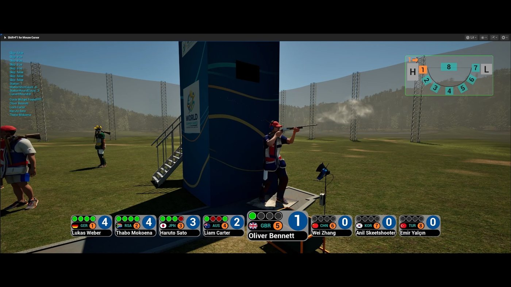
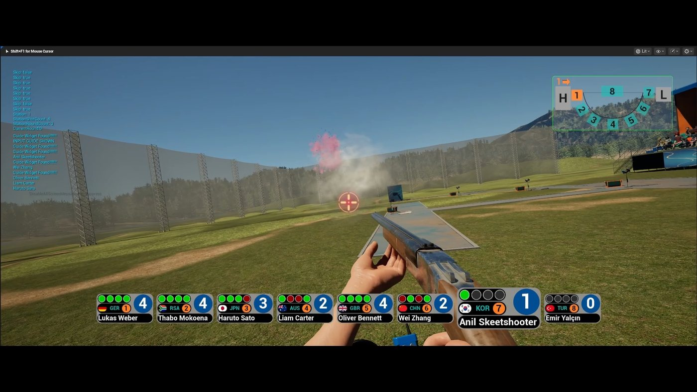
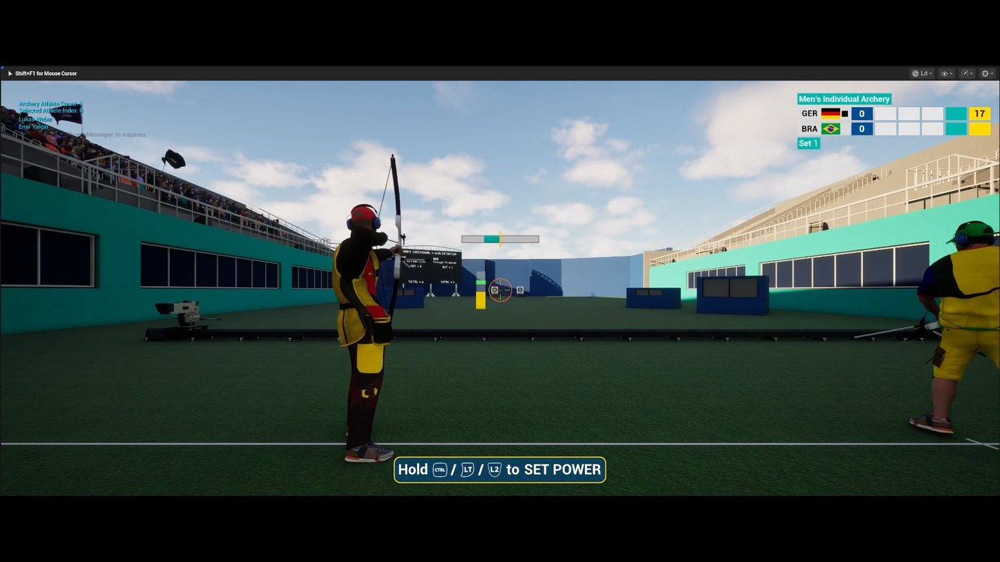
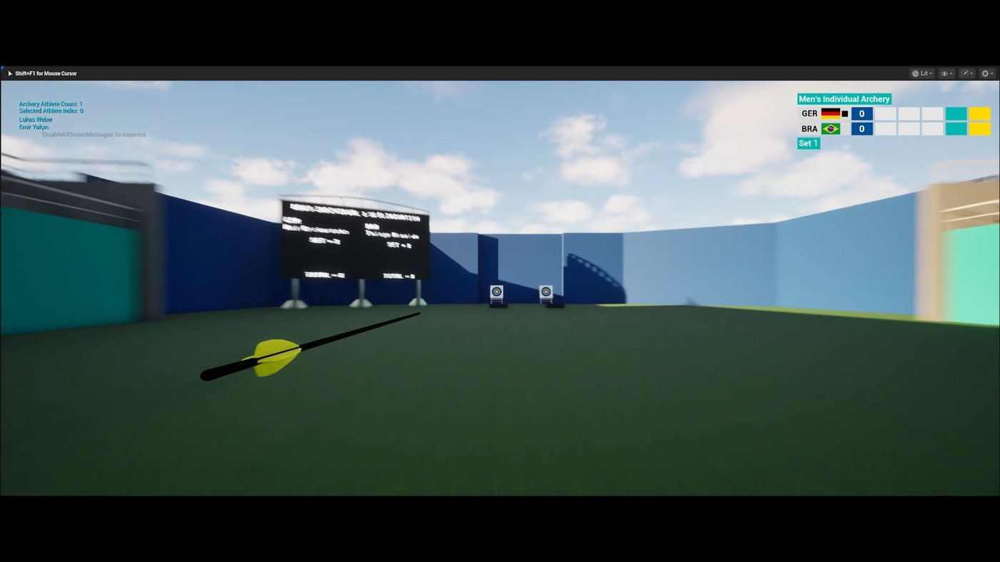
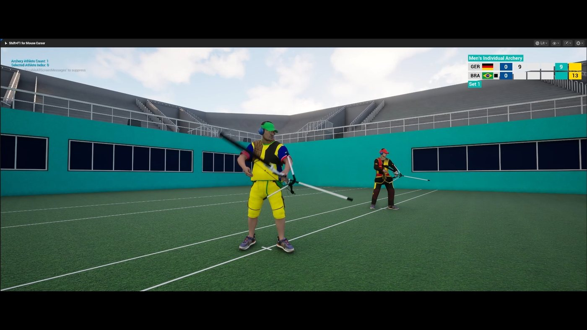

# World Summer Games

World Summer Games is an Unreal Engine sports-simulation project currently in alpha testing, with a planned public alpha release. The project focuses on realistic Olympic-style disciplines.

Archery and trap shooting are playable in the current showcased build.

## Media

- [Gameplay video on Google Drive](https://drive.google.com/file/d/1GWu0ciN8cG9hIKJAoNROwaAcTcCnCIXd/view?usp=drivesdk)
- [Screenshot gallery on Google Drive](https://drive.google.com/drive/folders/157E0qxsBUpxvuFYl-neeqJrwOqiyQsMA)

## Screenshots

## Technical Scope

- **Engine:** Unreal Engine
- **Current status:** Alpha test project
- **Playable disciplines shown:** Archery and trap shooting
- **Repository contents:** Documentation, resized screenshots and external media links only

## Notes

The full Unreal Engine project, packaged builds and development history are not included in this repository. The video is hosted externally because the source file is large.
